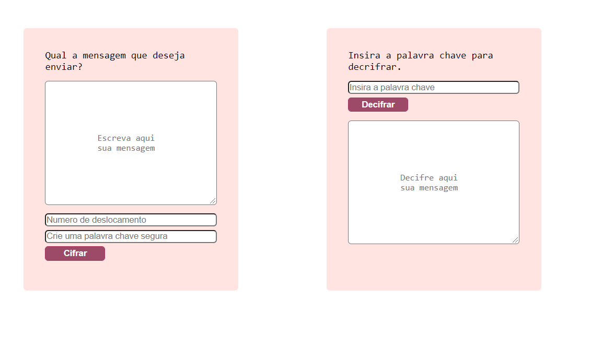
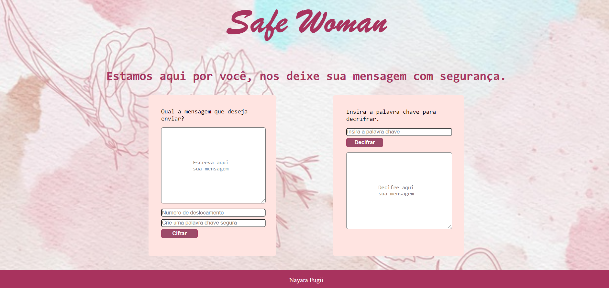

## Cifra de César

Cifra de césar é umas das técnicas de criptografia onde as letras são substituidas pelo número de casas definida pelo usuário. Com essa técnica foi desenvolvido o projeto <b>Safe Woman</b>.

* _Exemplo: (A letra A deslocada 2 casas a frente retorna criptografada na letra C, a letra B retornaria D e assim sucessivamente)._

 
Levando em consideração que o objetivo da criptografia é a segurança das mensagens do remtetente, o projeto foi desenvolvido com o intuito de promover a segurança de usuárias que sofrem quaisquer tipo de violência e precisam  sentir segurança ao pedir ajuda.

## Definição do desenho

O desenho do projeto foi pensado como duas caixas na interface onde uma o remetente da mensagem a digita, escolhe o número do seu _offset_ (casas de deslocamento) e define uma senha logo após temos o botão _cifrar_ levando em consideração o passo a passo do usuário. Da mesma forma foi pensado no passo a passo do receptor, onde temos o campo da senha e o botão para _decifrar_ a mensagem.

 
 

 * _Na paleta de cores foram escolhidos tons rosados:_

 

 ## Usuários

 O projeto Safe Woman traria aos seus usuários segurança ao reportar uma denúncia, ainda que o projeto em sí seja apenas a interface de funcionamento de decodificação da mensagem, futuramente seria incluso o envio da senha 🔒 definida pelo remetende por email para o receptor que estivesser cadastrado na interface para fornecer auxiliar as vítimas, e por meio dessa senha, conseguir acesso a mensagem decifrada. Com esse método de segurança, seria também uma maneira de o agressor não ter acesso a mensagem enviada.
 

 * _Ao final do projeto, temos a seguinte interface:_

 

 ## Ferramentas Utilizadas

 * Vanilla JavaScript
 * HTML
 * CSS

 